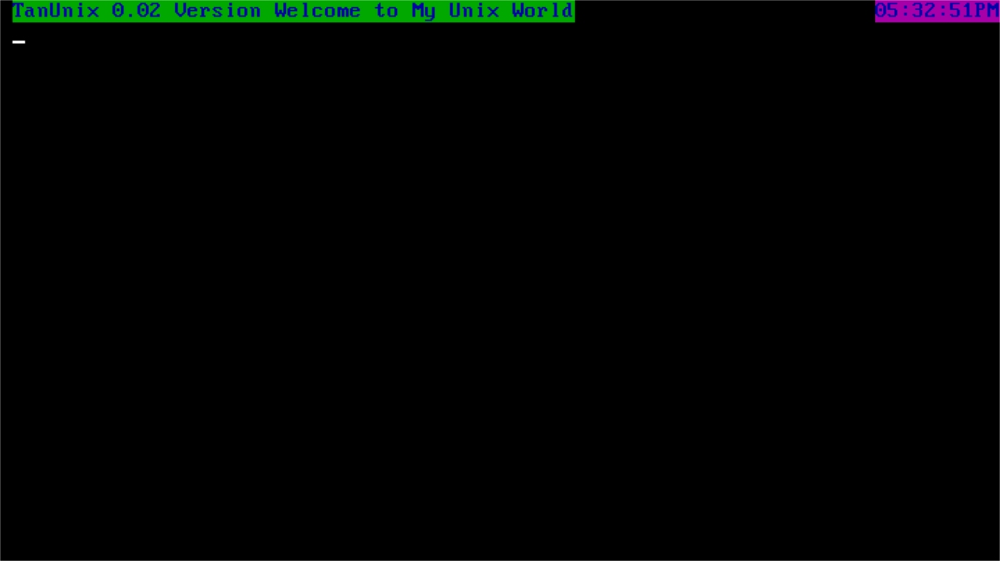

tanunix
=======

My First 32 bit protected mode operating system just for fun.This is totally based on Brandon Friesen's kernel development tutorial.This is  just a learning os with 32 bit projected mode features.
After a long day back I am starting this project to start again for production ready.
This is a journey not destination.

### Development

#### Prerequisite

```
need gcc and nasm binary in your system
make clean
```

#### QEMU Quick Launch

```
make test
```

#### Build

Use make to build binaries and image files.

```
make
```

##### Tests

Currently preloaded grub booted floppy image will be run using compiled kernel file

```
make test
```
